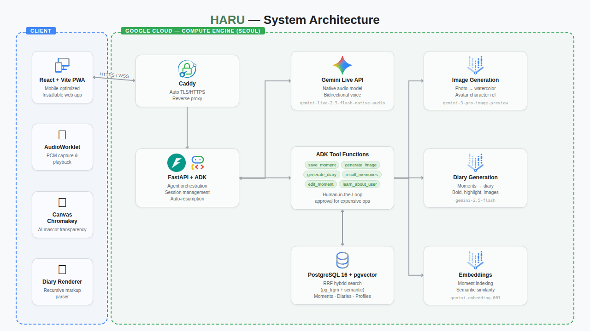

# HARU — AI Voice Diary

> **Just talk about your day.** Haru listens, remembers, and creates a beautiful diary for you.

HARU is an AI-powered voice diary that turns everyday conversations into illustrated diary entries. Talk to Haru like a friend — it remembers your stories, generates watercolor illustrations, and compiles your day into a handwritten-style diary.

[](https://youtu.be/Fa8PjRKog-w)

## Features

- **Real-time Voice Conversation** — Talk naturally using Gemini Live API with native audio. Haru responds with personality, asks follow-ups, and reacts like a real friend.
- **Auto-save Moments** — Key moments from your conversation are automatically captured via Gemini Tool Calling, complete with emotions and timestamps.
- **Watercolor Illustrations** — Moments are transformed into warm, hand-drawn watercolor illustrations using Gemini image generation, with your avatar as a character reference.
- **Rich Diary Generation** — At the end of your day, Haru compiles all moments into a beautifully formatted diary with **bold highlights**, ==marker effects==, and embedded illustrations.
- **Human-in-the-Loop (HITL)** — Image and diary generation require user approval via a floating UI before execution, preventing unwanted API calls.
- **Multi-language Support** — Korean, English, and Japanese. Haru follows the language you speak, not just the setting.
- **RAG Memory** — Haru remembers past conversations using RRF hybrid search (pg_trgm keyword + pgvector semantic), enabling contextual recall across sessions.
- **Weather Integration** — Current weather is automatically attached to each moment and displayed in diary entries.
- **Calendar View** — Browse past diary entries with monthly calendar, emoji indicators, and weather info per day.
- **PWA** — Installable as a mobile app with offline-capable service worker.

## Architecture



## Tech Stack

| Component | Technology |
|-----------|------------|
| Voice Conversation | Gemini Live API via ADK (`gemini-live-2.5-flash-native-audio`) |
| Image Generation | Vertex AI (`gemini-3-pro-image-preview`, location=global) |
| Embeddings / RAG | Vertex AI (`gemini-embedding-001`) + pgvector |
| Diary Generation | Vertex AI (`gemini-2.5-flash`) |
| Agent Framework | Google ADK (Agent Development Kit) |
| Backend | Python / FastAPI / uvicorn |
| Database | PostgreSQL 16 + pgvector |
| Frontend | React 19 + TypeScript + Tailwind CSS v4 + Vite |
| Audio | AudioWorklet (16kHz input / 24kHz output) + WebRTC loopback |
| Hosting | Google Cloud Compute Engine (asia-northeast3, e2-medium) |
| TLS / Proxy | Caddy (auto HTTPS) |
| Weather | Open-Meteo API (free, no key required) |

## Google Cloud Services Used

1. **Vertex AI — Gemini Live API** (real-time bidirectional voice streaming via ADK)
2. **Vertex AI — Image Generation** (watercolor illustration generation)
3. **Vertex AI — Embeddings** (semantic search for RAG memory)
4. **Compute Engine** (application hosting, e2-medium in Seoul)

## Getting Started

### Prerequisites

- Python 3.12+
- PostgreSQL 16 with pgvector extension
- Node.js 20+
- Google Cloud project with Vertex AI API enabled

### Setup

```bash
# Clone
git clone https://github.com/Great-Root/haru-ai-diary.git
cd haru-ai-diary

# Python dependencies
python -m venv .venv
source .venv/bin/activate
pip install -r requirements.txt

# Frontend dependencies
cd client && npm install && cd ..

# Database
createdb harudb
psql harudb -c 'CREATE EXTENSION IF NOT EXISTS vector'
psql harudb -c 'CREATE EXTENSION IF NOT EXISTS pg_trgm'

# Environment
export GOOGLE_CLOUD_PROJECT=your-project-id
export GOOGLE_CLOUD_LOCATION=us-central1
export GEMINI_API_KEY=your-api-key

# Development
bash scripts/dev.sh

# Production
bash scripts/prod.sh
```

### Environment Variables

| Variable | Description |
|----------|-------------|
| `GOOGLE_CLOUD_PROJECT` | GCP project ID |
| `GOOGLE_CLOUD_LOCATION` | Vertex AI location (default: us-central1) |
| `GEMINI_API_KEY` | Gemini API key |
| `DATABASE_URL` | PostgreSQL connection URL |
| `PORT` | Server port (default: 8080) |

## How It Works

1. **Start talking** — Press the mic button and talk about your day naturally.
2. **Moments are saved** — Gemini identifies meaningful moments and saves them with emotions, timestamps, and weather.
3. **Approve illustrations** — When Haru wants to draw, you'll see an approval button. Tap "Sure!" to generate.
4. **Generate your diary** — Ask Haru to write your diary, approve it, and get a beautifully formatted entry with illustrations.
5. **Browse history** — Use the calendar view to revisit past days, moments, and diaries.

## Key Technical Highlights

- **Session Resumption** — Transparent reconnection via ADK's `SessionResumptionConfig` for uninterrupted conversations
- **Context Window Compression** — Automatic sliding window (100K trigger → 80K target) for unlimited session length
- **Playback End Detection** — AudioWorklet tracks empty frames to release auto-mute only after audio finishes playing
- **Canvas Chromakey** — Real-time per-pixel black background removal for mascot animation
- **Virtual Carousel** — DOM-cached column rendering with pointer drag, momentum, and auto-scroll
- **Rich Diary Rendering** — Recursive parser for nested **bold**/==highlight== with lined notebook paper CSS

## Category

**Live Agents** — Gemini Live Agent Challenge

## License

MIT
